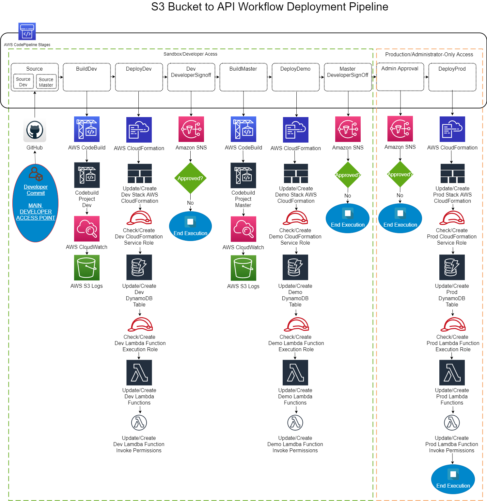

============================================================
Continuous Integration & Deployment 
============================================================
.. contents:: :local:

Purpose
========
In order to follow industry best practices, the author has implemented a CI/CD pipeline.
Given that this project is a serverless application built around AWS services, we have chosen to
build this pipeline using AWS CodePipeline

Diagram
========
The following is a diagram of the CodePipeline along with the services it employs.

Template
========
The CodePipeline template below is an export of the latest version of the pipeline. This template may be 
used to create the skeleton of the pipeline in other environments. Please note that although this will 
create the pipeline and the steps within it, the resources it uses such as CodeBuild projects or 
service roles.

*Under Construction. Template to be added*